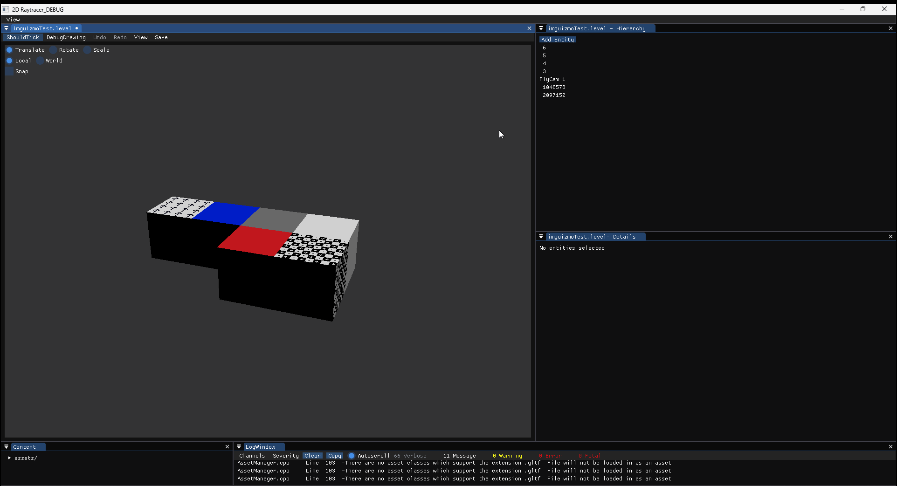
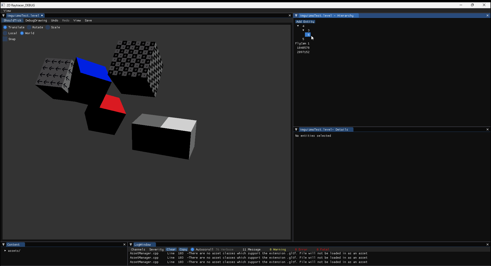

Coral Engine began as a personal project during a summer holiday. Over time, it evolved into a full-fledged engine featuring **visual scripting** and a **robust editor**. From the start, the goal was to create a simple, accessible API for developers while ensuring the engine remained intuitive for designers.

After seven months of solo development, I was joined by five talented programmers to enhance Coral Engine, making it production-ready. We used it to develop [Lichgate](/projects/lichgate.html). The designers who joined our team were able to utilise its capabilities to create their own prototypes, assets and gameplay features.

I continued working on Coral Engine for several months, ridding it of some technical debt that had built up over the course of development.

# My Contributions

- *[Engine Architecture](#engine-architecture)*: Designed and iterated the **core architecture** from concept to release.
- *[Asset management](#content-pipeline)*: Created a system for importing, editing assets and efficiently managing resources in a **multi-threaded** environment.
- *[Runtime reflection](#runtime-reflection)*: Created a system to represent both C++ and Visual Script classes through a unified interface.
- *[Visual Scripting](#visual-scripting)*: Built a performant node-based **visual-scripting interpreter** from scratch, fully integrated with the ECS system (EnTT).
- *[Optimisations](#optimisations)*: I have consistently benchmarked, profiled and accordingly optimised the worst bottlenecks.
- *Event handling*: Developed an powerful, easy-to-use event system.
- *[Physics](#physics)*: Helped created a 2D **physics** system with **optimized** collision handling.
- *[Prefab System](#prefabs)*: Implemented a system similar to [**Unity's prefabs**](https://docs.unity3d.com/Manual/Prefabs.html), allowing entity euse.
- *Level editor*: Developed a **user-friendly editor** for level design, included tools for quickly transforming objects and undoing changes.
- *Particle system*:  Created an extendable, **data-oriented** particle system.
- *Serialization*: Designed a serialization system with backward compatibility.
- *Unit Test Framework*: Created a light-weight framework for quickly creating tests in-engine.
- *CI/CD*: Set up **GitHub Actions** for automatic compilation, testing, and distribution.
- *[Utility AI](#utility-ai)*: Created a framework for state-based **AI** behaviour.
- *Project management*: I **managed** the team of programmers, overseeing task distribution and ensuring alignment.
- *Frontend*: I played a large part in utilising ImGui to create an accessible interface for designers, including the content browser and most editor windows.


# My contributions to Lichgate
- *Flowfields*: Implemented an optimized flowfield algorithm for **AI** navigation.
- *Procedural Endless World*: Developed tools for Level designers for generating endless, **procedural levels**.

# Games Created with Coral Engine

- [Lichgate](/projects/lichgate.html)

# Engine Architecture

I have iterated many times on the engine architecture before reaching a 'stable' point that could be built upon.

## Ownership


Not the most beautiful or accurate diagram, as it was drawn live during a presentation. Horizontal arrows between subsystems indicate communication, e.g. the editor getting an asset from the asset manager, while vertical arrows indicate ownership.

## Separation of concerns

There is a clear separation of concerns embedded in the architecture of this engine. There are three types of systems; EngineSubsystems, EditorSystems, and regular systems present in the ECS. 
Each regular system in the ECS works in isolation from the other ECS systems. I specifically did not expose a function to get a pointer to a system inside of the registry to encourage this separation. The same applies to editor systems; A level editor does not know or interact in any way with a prefab editor, or another level editor.

The only exception is EngineSubsystems. These are essentially singletons, that can be accessed from anywhere in the engine, even other subsystems; The editor subsystem may retrieve an asset from the asset manager to open it for edit. They still have a clear separation of concern, with little overlap between them. I have improved upon this further during this block, moving some of the editor-only importing logic from the asset manager (EngineSubsystem) to a dedicated importer system (EditorSystem).

## Cross-platform

I was responsible for the cross-platform support in the first sprint for everything not related to the rendering. The main challenge with cross-platform support involved backporting the engine back to C\++17, of which C\++ concepts were the hardest feature to replace. I needed to make some changes to serialisation as well, as typeids are not platform agnostic.

We used a few different approaches for cross-platform support. The Input.h header for example is shared across platforms, while the cpp file contains platform-specific definitions. In other cases, we used an ```#ifdef``` to redirect the include to the platform-specific one.

```cpp
// In StaticMesh.h

#ifdef PLATFORM_WINDOWS
#include "Platform/PC/Rendering/StaticMeshPC.h"
#elif PLATFORM_PROSPERO
#include "Platform/Prospero/Rendering/StaticMeshProspero.h"
#endif
```

There are buffers, shaders and pipelines that are platform-specific, so the idea was that each platform would have separate members and functions. It would make sense for each platform to have a separate class.

### Did we make the right decision?

The cross-platform rendering architecture should have been implemented differently. This is something we learned from as a team, as our current approach led to an unusually large amount of repeated code. It makes it difficult to implement new features, as you have to write the entire implementation for both platforms. The asynchronous loading of textures on PC only has a few lines that are related to DX12, but it is difficult to combine the common functionality if there is no common class for both platforms. We should have created the platform-specific abstractions on a lower level; buffers, shaders and pipelines could have a platform-specific implementation, to be used by a platform-agnostic StaticMesh. This would have reduced code repetition and created a more easily maintainable codebase.

The project compiles and runs on all platforms. The warning level has been set at the highest level on both platforms, with warnings treated as errors.

## Engine & Game seperation

We discussed with the team what approach to take. 


The image above shows the pros and cons of each approach. In the end, we decided to compile the Engine into a static library.

I was responsible for separating the engine and the game. The game is a separate project from the engine. I've learned an important lesson on managing a large quantity of platforms and configurations; I've learned how to use property sheets to avoid repetition. While this took a while to set up, it has made the project easier to configure.


There are assets that are unique to each game, but also common assets that are shared between games.


### Did we make the right decision?

In the end, we spent around half a week separating the engine and game into separate C++ projects. But in our final demo, there was almost no game-specific-C++ used, everything was powered through visual scripts instead. The separation of engine and game assets has been immensely useful. We should however have more seriously considered the option of having our game consist of assets alone, with each game having its own separate assets folder. 

While the separation of engine and game on the C++ side has not paid off during the current block, we expect that it will become more useful during the last block. Our game will grow more complex over time, and it is nice to have the option to move complex systems to C++.

## Engine & Editor seperation

We have multiple configurations to allow the user to choose whether they want optimisations and/or the editor.


We want to deliver a well-optimised release build to the designers and artists, while new features are tested in the debug configurations.

We removed the editor from the Debug and Release configuration by excluding certain files from compilation, and by the occasional ```#ifdef EDITOR```.

### Did we make the right decision?

The separate configurations for the editor are confusing to someone new to the engine, especially as Visual Studio picks the Debug configuration by default the first time you start the project. The tradeoff is that we have a much faster editor and that we are able to test release builds with all the functionality the editor provides.

In hindsight, the separation of the engine and the editor could have been made a lot cleaner. Every time you add an editor-only file, you have to *remember* to exclude it for all platforms. We could have had a separate project for the editor, which would have helped with more strictly enforcing the separation.

## Rendering refactor

The rendering architecture of the engine had been mostly neglected during the initial months. There was a lot of technical debt from having survived an OpenGL implementation, an XSR rewrite, before continuing on to a cross-platform DX12 and Prospero implementation. There were functions being called that were just empty, there were classes that had grown redundant, or whose names no longer matched their functionality, and there was no shared data between worlds at all; which sounds good in practice, but was taken to such an extent that shaders were compiled separately for each world.

Since we expected this project to last at least four more weeks, possibly twelf, it was justified to allocate resources to refactor and improve the rendering backend. Marcin, one of our graphics programmers, proposed a new architecture and discussed it with me, as I was very involved with the initial implementation and overall engine architecture.


His implementation was well thought out but required some adjustments. He got rid of all the buffers owned by the world and made them all shared instead. I pointed out that there is definitely still data that needs to be unique per world; their framebuffers, the size and position of the viewport and the debug lines buffer. We discussed some alternative solutions and ended up deciding on the GPUWorld itself being responsible for the rendering, and accessing the shared resources in Engine::Renderer as needed.


## Content pipeline

I spent a lot of time on the content pipeline, the importing, editing and loading of assets.

### Importer pipeline

The importing pipeline is something I created during block A. The code behind it is robust, yet easy to understand. Leo was new to the importing system at the start of the block, but it did not take long for him to get a deep understanding of how the system works, to add onto it by importing skinned meshes and to make changes to existing importers. At the end of the block, he visualised our importer pipeline. The chart shows the steps taken during the importing of a model.


In sprint four part of our sprint goal was to refine our engine's toolchains and workflows. The importing previously happened 'automatically' when changes were detected. This gave the user very little control, and it often led to unneeded reimporting and overwritten changes. When importing large files, or asset packs containing many models, the engine would freeze for up to several minutes. It became apparent that this process required optimisation. 

I had always found multi-threading to be too bug-prone for it to be worth it. Often the computation needed for collecting the jobs and creating the threads led to insignificant performance improvements. In this block, I learned about and applied asynchronous operations; a thread gets launched to perform an expensive task, while the main thread continuously updates the engine, occasionally checking if the result is ready yet. It makes the application more responsive and leads to performance improvements that would otherwise not be possible. The use of multi-threading makes more sense to me now.

```cpp
mImportFutures.emplace_back(
	ImportFuture
	{
		fileToImport,
		std::string{ reasonForImporting },
		std::async(std::launch::async, 
			[fileToImport, importer, isCancelled = mWasImportingCancelled]() -> Importer::ImportResult
			{
				if (*isCancelled)
				{
					return std::nullopt;
				}

				return importer->Import(fileToImport);
			})
	});
```

Asynchronously processing the files has led to significant performance improvements, it is around 8x faster. The system duly informs the user that it is performing work.


The simplicity of the importing process has become a selling point towards artists.


Any assets can be reimported at runtime while keeping any unsaved changes in our editor intact.

### Editing pipeline

We have created a universal system for editing assets at runtime.


Classes can derive from AssetEditorSystem. The AssetEditorSystem owns the copy of your asset, it is responsible for saving assets to a file and provides some functionality for undo/redo, but more on that later.

We are not live-editing the original instance of the asset, as it could be dangerous to work on assets that are referenced throughout the engine. We instead work on a copy of the original asset. We make our changes and only apply them to the original asset when saving. This is why we only distribute const handles towards the users; if you want to edit an asset, you will have to go through the proper channels.

When finally saving an asset to a file, the editor does a soft restart, making sure to save any unsaved changes to memory first. The stack of changes present in each asseteditor is carried over, to ensure your progress does not get erased.

#### Did we make the right decision?

I am quite happy with the asset editing system. It abstracts a lot of the complex functionality away from most programmers, it is simple to add your own assets to it, yet offers plenty of features.

The only regret I have is the way I decided to give out references to assets to the rest of the engine. Currently, we have ```WeakAsset```, which are handles for a possible unloaded asset. But for our actually loaded-in assets, we use ```std::shared_ptr```. This is not only inconsistent, but it also means that you sometimes get more information from the ```WeakAsset``` (the file it was imported from, the version, etc.) than from the loaded-in asset. We also wanted to make the change that assets only get loaded in when the handle is dereferenced, but this could not be achieved with the simple ```std::shared_ptr``` we are using now. The API would have been more consistent if we created our own AssetHandle for loaded-in assets. 

### Undo

Our engine supports an 'undo' feature for all assets. A simple feature, but complicated to implement!


*Transform components can have parents and a variable number of children. Each action can be undone using CTRL_Z or through the undo button.*


*Even destroyed components and entities can be brought back in the exact same state*

In the first iteration, I implemented this using the command pattern. Each edit is defined using a Do and Undo function. For most edits this is trivial; if we move an object to X, we can just as easily move it back to Y. But for destructive edits, this is trickier; if we destroy a component, we no longer have the information necessary to bring it back. In the destroy entities edit below, I resolved this by serializing the state of the entity at the time of destruction.

```
struct DestroyEntities :
	public DoUndo
{
	DestroyEntities(Registry& registry, std::vector<entt::entity> entitiesToDestroy) :
		mRegistry(registry),
		mEntitiesToDestroy(std::move(entitiesToDestroy))
	{
		for (auto entity : mEntitiesToDestroy)
		{
			mSerializedEntitiesToRestore.emplace_back();
			Archiver::Serialize(registry, entity, mSerializedEntitiesToRestore.back());
		}
	}

	void Do() override
	{
		for (auto entity : mEntitiesToDestroy)
		{
			mRegistry.DestroyAlongWithChildren(entity);
		}
	}

	void Undo() override
	{
		for (const auto& entityToRestory : mSerializedEntitiesToRestore)
		{
			Archiver::Deserialize(mRegistry, entityToRestory);
		}
	}

	Registry& mRegistry;
	std::vector<entt::entity> mEntitiesToDestroy{};
	std::vector<GSONObject> mSerializedEntitiesToRestore{};
};
```

This quickly got out of hand; it was difficult to maintain, and it was easy to make mistakes.

I decided to switch to the memento pattern, where you save different versions of your asset to memory in order to restore them later. Because we are using the memento pattern, the undo system is universal; if you are able to save your asset to a stream, your asset editor will have undo functionality.

## Conclusion

I have personally contributed to the majority of this Engine's architecture. By keeping each system separate from each other and preventing communication between them, we ensure that each system acts only on the data that it should be concerned about. I have struggled in the past with separating concerns when the systems were closely tied together, but I have learned how to do so during this block, such as by moving the importing behaviour out of the asset manager and into the new importer system.

I was responsible for getting the engine to compile for PS5 while our graphics programmers worked on implementing cross-platform rendering. We took similar approaches as Bee and were able to compile for PS5 all the way back in sprint one. We have created a product that compiles and runs without errors or warnings on all target platforms. We learned lessons along the way, and in hindsight, we regret the way we have implemented cross-platform rendering.

In order to create a clear distinction between engine and game, by creating separate projects and asset folders. I learned about property sheets, and how they can be used to better maintain the different configurations and platforms we support while having little repetition in our engine and game .vcxproj files. We used a much more primitive approach to separate the editor from the engine, but this primitive approach still remained effective and simple to use. I have learned more about separation, and in future codebases, I would instead choose to make the editor a separate project.

Our content pipeline is a system that was carried over from my previous block and has been iterated on and refined many times. The content pipeline is clearly explained using visual diagrams with further elaboration where necessary. Artists and designers are able to import and edit assets as needed, while the code behind it is robust and scalable.

We very organically came to a point where we sat down to discuss important design decisions. We used visual explanations where needed, went back and forth to discuss the pros and cons of each approach, and were always able to settle on a design direction. Documented examples included the implementation of the utility AI system and the rendering refactor, but many more discussions were held throughout the sprints.

As a programmer, I have contributed to a well-designed architecture for a cross-platform game engine, content pipeline, and demo game, so that the codebase is easy to use and understand.

# Runtime reflection

Types can be easily reflected and exposed to the scripting tool. The reflection system is capable of reflecting every class, including their constructor, baseclasses, private fields and functions.

Let's say you have this imaginary class:

```cpp
namespace CE
{
	class ParticleEmitterComponent
		: public ExampleBaseClass
	{
	public:
		ParticleEmitterComponent(uint32 numOfParticles);

		// Events!
		void OnBeginPlay(World& world, entt::entity owner);

		void PlayFromStart(bool destroyExistingParticles);

		glm::vec3 mMinInitialLocalPosition{};

		// Why is this a float you might ask?
		// If you want to, for example, spawn .5f particles per frame, you can't do anything the first frame, as you can't spawn half a particle.
		// But the next frame, two halves make one whole.
		float mNumOfParticlesToSpawnNextFrame{};

		/// ... More data members

	private:
		friend ReflectAccess;
		static MetaType Reflect();
		REFLECT_AT_START_UP(ParticleEmitterComponent);
	};
}
```

You can add a ```Reflect``` function. The REFLECT_AT_START_UP macro informs the engine of it's existence when the program initializes. The Reflect function is trivial to implement, and gives the user a chance to customise some behaviour by adjusting properties:

```cpp

CE::MetaType CE::ParticleEmitterComponent::Reflect()
{
	MetaType type = { 
			MetaType::T<ParticleEmitterComponent>{}, 
			"ParticleEmitterComponent", 
			MetaType::Ctor<uint32>{}, // Registers our constructor
			MetaType::Base<ExampleBaseClass> // Registers our baseclass
	};

	type.GetProperties().Add(Props::sIsScriptableTag);

	type.AddField(&ParticleEmitterComponent::mDestroyOnFinish, "mDestroyOnFinish")
		.GetProperties()
			.Add(Props::sIsScriptableTag);

	type.AddField(&ParticleEmitterComponent::mNumOfParticlesToSpawnNextFrame, "mNumOfParticlesToSpawnNextFrame")
		.GetProperties()
			.Add(Props::sIsEditorReadOnlyTag)
			.Add(Props::sNoSerializeTag);

	type.AddFunc(&ParticleEmitterComponent::PlayFromStart, "PlayFromStart")
		.GetProperties()
			.Add(Props::sIsScriptableTag)
			.Add(Props::sCallFromEditorTag);

	BindEvent(type, sOnBeginPlay, &ParticleEmitterComponent::OnBeginPlay);

	ReflectParticleComponentType<ParticleEmitterComponent>(type);
	return type;
}
```

No static reflection or code-generating tools, everything is pure C++ and almost entirely macro-free. This makes the tool easy to use by other programmers.


*The reflected fields and functions, as seen in the script editor*

### Limits

Function arguments are only allowed in limited forms. Parameters can only be of the form Value, Ref, ConstRef, Ptr, ConstPtr, or RValue. A pointer to a pointer for example is not supported. If your codebase has a lot of pointers to pointers or references to pointers, this runtime reflection system may not be the one for you.

### Strengths

The best part of our runtime reflection system? It supports 'fictional' types, types that have no C++ equivalent. This helped greatly with implementing the next feature, Visual Scripting!

# Visual Scripting

I spent around eight weeks on implementing visual scripting. The backend was made entirely from scratch, while the frontend used existing ImGui plugins.

## What can this tool do?

**Demo**

The scripting tool is designed to be general purpose. There is a wide variety of games that can be implemented using this tool. I have created three very simple demos of various complexities to show what is possible through scripts.


*The player movement implemented through scripts. Pressing spacebar spawns prefabs around the player, showcasing that scripts can reference and use assets*


*A very simple demo. Enemies move around from point to point, and select a new random point once their target has been reached. The user can shoot and kill enemies, who are then respawned. Everything was implemented through scripts, including the enemy behaviour, the player movement, the collision and the respawning of the enemies.*


*A timelapse showing the creation of the demo intended for the showcase day. The demo took 1:40 hours to make.*


*The result of the above timelapse. A simple top-down game. The user can walk around, collect coins, and purchase weapons. Crates can be destroyed to acquire more coins. Once again, **everything** was implemented through scripts.*

**Scripts can be interacted with from C++**

There is no distinction between a reflected C++ class and a compiled script once they are inside the runtime reflection system, which means you do not need to write more code to account for the script components; a function that serializes components by iterating over their members does not need to know or care whether the underlying component is a script or a C++ class, it just serializes it. I wrote my own runtime reflection system to achieve this.

Script functions can be easily called. Error checking has been left out for brevity's sake.

```cpp
const MetaType& const type = *MetaManager::Get().TryGetType(scriptName);

for (int32 i = 0; i < 10; i++)
{
	FuncResult constructResult = type->Construct();
	MetaAny& instance = constructResult.GetReturnValue();

	const MetaFunc& const func = *type->TryGetFunc(funcName);
	FuncResult result = func(instance, i);

	if (*result.GetReturnValue().As<int32>() != i)
	{
		return Result::FAILURE;
	}
}

return Result::SUCCESS;
```

**Scripts can interact with other scripts**


*Script functions can be called from other script functions. Here IsEven is a function created using scripts and is called from an IsOdd function.*

**Mix and match**

You can write a game entirely using C++, entirely using scripts or a mix of both. You can call and access C++ functions and fields from scripts, and call and access script functions from C++. This allows programmers to develop complicated or computationally expensive gameplay elements, while designers can prototype and rapidly iterate using the scripting tool.

**Searching**


*A search bar has been implemented to speed up development*

**Direct integration with entt**

The components live inside of an ```entt::storage``` specialized for script components.  There is no indirection, the memory layout is the exact same as if the component were a C++ class. Possibly even better, because unlike in C++, the order of the fields are shuffled to minimise padding.


*Scripts can have hold data. They can be added as a component to entt::registry*

You do not have to take into account the edge case of script components anywhere in your code. ```entt::registry``` offers the ```storage()``` function to iterate over all the storages. This is useful when you want to inspect or serialize a registry. Since our scripts are stored inside one of these, they can be accessed through the call to storage.

```cpp
void Engine::Archiver::Serialize(const Registry& registry, BinaryGSONObject& gsonObject)
{
	for (auto&& typeStoragePair : registry.Storage())
	{	
		// We can use the same function to serialize both C++ classes and 
		// script classes.
		SerializeStorage(registry, gsonObject, typeStoragePair);
	}
}
```

**Undo, redo, copy, cut, paste and duplicate**

 A selection of nodes and links can be copied and pasted, allowing for rapid refactoring and expansion of your scripts. If you ever make a mistake, each action can be undone/redone using CTRL+Z/CTRL+Y. The do-undo has been implemented using the memento pattern.


**Errors and checks**

I have written and mantained around a dozen unit tests using the visual scripting tool. They allow me to catch mistakes and bugs early on.

The return value of functions can be checked and validated using the IsNull node.


*If the user does not have a transform, IsNull would return true in the script above.*

But no need to remember to check for null constantly; if you ever forget, a helpful message will be printed to the console. Some errors can even be caught at compile time, making your scripts less error-prone.


*Pressing it navigates the focus directly to the source of the error.*

**Reroutes**


*Reroute nodes can be used to clean up your scripts*

## How does it work?

The Visual Scripting uses a node based interpreter. I follow the execution links while recursively walking up the tree where needed to obtain the outputs from any pure nodes. 

I initially wanted to go for a bytecode based approach; it's a subject I'd been interested in for a while and one I wanted to learn more about. There is an opportunity for an optimization pass to shift more of the workload to compile time. 

In the end I decided against it, it's an additional layer of complexity that makes the system more difficult to debug and extend. The idea was that if the performance was lacking, there might be more benefit to transpiling to C++, or to use LLVM directly. 

The node based interpreter still benefits from plenty of optimisations, for example by caching outputs, allocating on a stack and using RVO. I have additional optimizations for trivial types, by for example avoiding the indirection of invoking the copy constructor when a memcpy will suffice.

## Optimisations

I have regularly optimised Coral Engine throughout the year. I tracked some optimisations I made to the visual scripting interpreter over the course of one week.

### Workflow

I created a small tool for benchmarks. It runs the level for 1 real-world minute and measures the average delta time. Each benchmark ran with various amounts of enemies. This allowed me to accurately and consistently measure the result of my optimizations. After each change, I ran the benchmark to confirm it had a positive effect. I use Visual Studio's profiler to determine the most problematic areas.

### Benchmark


The environment consisted of enemies moving from point to point.


The behavior of an individual enemy.

**Initial benchmark**


| N                       	| 1e2      	| 1e3      	| 1e4      	| 1e5      	| 1e6      	|
|-------------------------	|----------	|----------	|----------	|----------	|----------	|
| Average deltatime (Ns)  	| 9.61E+05 	| 9.11E+06 	| 9.12E+07 	| 9.24E+08 	| 1.24E+10 	|
| Standard deviation (Ns) 	| 1.51E+05 	| 9.37E+05 	| 6.01E+06 	| 1.34E+08 	| 6.05E+09 	|

N: The number of enemies.
Average deltatime (Ns): The average delta time. The first frame has been left out, as it takes much longer than all the other frames and it would skew the results.
Standard deviation (Ns): How dispersed the delta time is in relation to the mean.


I analyze the overview to figure out which functions require the most optimization. I thoroughly examine the function calls that took up the highest total CPU time to figure out which lines require the most optimizing, and if there is any low-hanging fruit that can be easily optimized.

### std::vector in a hot-loop

**Before**


Executing each node requires collecting the inputs that we need to pass in. We executed a lot of nodes, and a lot of time was being spent on allocating a new vector for all of them.

```cpp
	// Collect the inputs that this node needs
	std::vector<MetaAny> valuesToPassToNode{};
	std::vector<TypeForm> valueForms{};
```

**After**

We know the number of inputs that the node has, so we can easily reduce this to a single stack allocation using alloca.

```cpp
	// Stack allocation
	MetaAny* inputValues = static_cast<MetaAny*>(_alloca(numOfInputPins * sizeof(MetaAny)));
	TypeForm* inputForms = static_cast<TypeForm*>(_alloca(numOfInputPins * sizeof(TypeForm)));
```


**Final result: 18.26% faster**


| N                       	| 1e2      	| 1e3      	| 1e4      	| 1e5      	| 1e6      	|
|-------------------------	|----------	|----------	|----------	|----------	|----------	|
| Average deltatime (Ns)  	| 1.11E+00 	| 1.01E+01 	| 1.00E+02 	| 9.86E+02 	| 1.17E+04 	|
| Standard deviation (Ns) 	| 2.88E-01 	| 1.75E+00 	| 7.39E+00 	| 2.40E+01 	| 8.15E+02 	|

### std::unordered_map slow emplace

**Before**


The cache was an unordered_map, but emplacing elements into the map took up too much time.

**After**

```cpp
context.mCachedValues.reserve(func.GetNodes().size() * 5);

// Populate the cache for faster lookup later
for (const ScriptPin& pin : func.GetPins())
{
	context.mCachedValues.emplace_back(pin);
}

// Binary search requires sorted vector
std::sort(context.mCachedValues.begin(), context.mCachedValues.end());
```

Searching through a vector is normally a linear process, but by utilizing binary search we can reduce this to O(Log(N)). The search time was now roughly the same as with the unordered_map.

```
// Binary search
auto existingCachedValue = std::lower_bound(context.mCachedValues.begin(), context.mCachedValues.end(), pin.GetId());
ASSERT(&existingCachedValue->mPinOfOrigin.get() == &pin);
return *existingCachedValue;
```

**Final result: 29.64% faster**


| N                       	| 1e2      	| 1e3      	| 1e4      	| 1e5      	| 1e6      	|
|-------------------------	|----------	|----------	|----------	|----------	|----------	|
| Average deltatime (Ns)  	| 9.61E+05 	| 9.11E+06 	| 9.12E+07 	| 9.24E+08 	| 1.24E+10 	|
| Standard deviation (Ns) 	| 1.51E+05 	| 9.37E+05 	| 6.01E+06 	| 1.34E+08 	| 6.05E+09 	|

### O(N) to O(1)

**Before** 

All the operations to go find a node, pin, or link by its id were O(N), it was a simple, but slow, linear search.


The pins were all over the place in memory, with each node having a separate vector for both its input and output pins.


The percentages were low in the profiler, but they showed up in several different places and added up together, it became apparent that searching for an element was one of the slowest parts, and it would scale poorly with larger functions.

**After**

By not erasing elements from the container but instead marking them as null, we can start using the Id as an index to the element in the array.

```cpp
void Engine::ScriptFunc::RemoveLink(LinkId linkId)
{
	ScriptLink* link = TryGetLink(linkId);

	if (link == nullptr)
	{
		LOG(LogAssets, Warning, "Link was already removed");
		return;
	}

	link->SetId(LinkId::Invalid);
}
```

We no longer have to sort the cache by the pin id at the start, because all the pins will already be sorted in a contiguous buffer.

```cpp
Engine::VirtualMachine::VMContext::CachedValue& Engine::VirtualMachine::FindCachedValue(VMContext& context,
	const ScriptPin& pin)
{
	return context.mCachedValues[pin.GetId().Get() - 1];
}
```

**Final result: 20.81% faster**


| N                       	| 1e2      	| 1e3      	| 1e4      	| 1e5      	| 1e6      	|
|-------------------------	|----------	|----------	|----------	|----------	|----------	|
| Average deltatime (Ns)  	| 6.28E+05 	| 5.78E+06 	| 5.78E+07 	| 5.99E+08 	| 1.10E+10 	|
| Standard deviation (Ns) 	| 1.43E+05 	| 9.51E+05 	| 6.09E+06 	| 2.25E+08 	| 1.19E+10 	|

### POD optimization

**Before**


12% of our execution is spent on resolving overloads between constructors (default, copy & move). 8.7% is spent on invoking a function that constructs the object.


15% of our time is spent on calling the destructor.

A lot of time was spent on constructing/destructing POD types, (such as integers, floats, vec3, etc.). This required looking up the type, looking up the necessary function, resolving any overloads, and finally invoking a std::function.

**After**

Rather than addressing the symptom, which is that a lot of time is spent in constructing and resolving overloads, I decided to address the root of the problem; that the constructors and destructors are being called at all. The fastest code is code that does not run. I now keep track of which types are plain old data.

```cpp
#define NUM_OF_BITS_FOR_SIZE 14
#define NUM_OF_BITS_FOR_ALIGN 6

struct TypeInfo
{
	TypeId mTypeId{};
	uint32 mSize : NUM_OF_BITS_FOR_SIZE {}; // Max size is 16384
	uint32 mAlignment : NUM_OF_BITS_FOR_ALIGN{}; // Max alignment is 64
	uint32 mIsTriviallyDefaultConstructible : 1 {};
	uint32 mIsTriviallyMoveConstructible : 1 {};
	uint32 mIsTriviallyCopyConstructible : 1 {};
	uint32 mIsTriviallyCopyAssignable: 1 {};
	uint32 mIsTriviallyMoveAssignable : 1 {};
	uint32 mIsDefaultConstructible : 1 {};
	uint32 mIsMoveConstructible : 1 {};
	uint32 mIsCopyConstructible : 1 {};
	uint32 mIsCopyAssignable : 1 {};
	uint32 mIsMoveAssignable : 1 {};
	uint32 mIsTriviallyDestructible : 1 {};
	uint32 mUserBit : 1 {};
};
static_assert(sizeof(TypeInfo) == 8);
```

This opens up a lot of doors in other places for optimization by avoiding lookups and function calls for POD.

```cpp
// We only have to invoke the destructor if this type is not trivially destructible
if (!mTypeInfo.mIsTriviallyDestructible)
{
    const MetaType* const type = TryGetType();

    if (type != nullptr)
    {
        type->Destruct(MetaAny{ mTypeInfo, mData }, false);
    }
    else
    {
        LOG(LogMeta, Error, "Cannot call destructor for type with id {}: Type was not reflected", GetTypeId());
    }
}
```

**Final result: 142.35% faster**


| N                       	| 1e2      	| 1e3      	| 1e4      	| 1e5      	| 1e6      	|
|-------------------------	|----------	|----------	|----------	|----------	|----------	|
| Average deltatime (Ns)  	| 2.70E+05 	| 2.51E+06 	| 2.51E+07 	| 2.51E+08 	| 3.09E+09 	|
| Standard deviation (Ns) 	| 5.31E+04 	| 2.84E+05 	| 2.37E+06 	| 2.26E+07 	| 7.55E+08 	|

### Simple lookup cache

**Before**

When executing a node, I had to look up the address of the function to call each time.

**After**

I now only look up the address once during the compilation stage.

**Final result: 35.57% faster**


| N                       	| 1e2      	| 1e3      	| 1e4      	| 1e5      	| 1e6      	|
|-------------------------	|----------	|----------	|----------	|----------	|----------	|
| Average deltatime (Ns)  	| 2.25E+05 	| 2.03E+06 	| 2.02E+07 	| 2.08E+08 	| 2.18E+09 	|
| Standard deviation (Ns) 	| 4.79E+04 	| 2.41E+05 	| 1.82E+06 	| 1.78E+07 	| 5.45E+08 	|

### Results


The total performance improvement was 718.87%. I spend around two days on optimization.

I went from O(N) to O(1). which allows for the execution of larger functions. 

The tool is designed for simple prototyping and gameplay, yet the scripts were still executed at 50fps when faced with 10'000 enemies.

### Discussion

**Missed measurements**

I cache the results of pure nodes; if no impure node has run, we can assume there are no side-effects to the state that would affect the return value of a pure node. Caching return values is likely the largest optimization I have implemented, but because they were part of my very first working implementation, I have no measurements to back this up.

**Future optimizations**

Profiling supports that allocating and freeing many small chunks of memory is currently the largest cost.


This call is in most cases a malloc and memset.


This calls free();

Every single time a function is invoked, we call malloc to store the return value. If the cached return value is out of date and we need to run the function again, we are freeing the original value, and calling malloc again. 

There would ideally only be one call to malloc at the very start of the program. A stack pointer would indicate where we should store our next value. We would use return value optimization to directly store the returned value at that position in the stack. At the end of each function, we simply roll back the pointer to the position it was in when we entered the function, calling the destructor only for the non-trivially destructible types.


# Physics

Coral Engine has a custom 2D physics system. While the system was created by [Amzy](https://www.linkedin.com/in/amalia-amzy-zarcu-001b57295/), I made various contributions over the course of development.

## Terrain height

We initially to have a level with vertical elements, but our physics system only supported 2 dimensions! 

This task was interesting as I was not involved with its original creation, and I had to adhere to the definitions of done already in place.


We have a very simple physics implementation. One constraint we have is that all of our colliders are 2D; the user does not need to specify the height of a cylinder. But now that we would be walking on the terrain, we need to know the height of the colliders beneath our feet.

I decided to use a very simple approach; iterating over the colliders, getting the height of the collider based only on its position, and then choosing the highest collider that overlaps the given 2D point.

```cpp
float CE::Physics::GetHeightAtPosition(glm::vec2 position2D) const
{
	float highestHeight = -std::numeric_limits<float>::infinity();

	GetHeightAtPosition<TransformedDiskColliderComponent>(position2D, highestHeight);
	GetHeightAtPosition<TransformedAABBColliderComponent>(position2D, highestHeight);
	GetHeightAtPosition<TransformedPolygonColliderComponent>(position2D, highestHeight);

	return highestHeight;
}

template <typename ColliderType>
void CE::Physics::GetHeightAtPosition(glm::vec2 position, float& highestHeight) const
{
	const Registry& reg = mWorld.get().GetRegistry();

	auto view = reg.View<const TransformComponent, const PhysicsBody2DComponent, const ColliderType>();

	// Don't do .each, as we may be able to do an early out, preventing us from
	// having to retrieve the other components at all.
	for (entt::entity entity : view)
	{
		// Only colliders in the terrain layer influence the height
		if (view.template get<const PhysicsBody2DComponent>(entity).mRules.mLayer != CollisionLayer::Terrain)
		{
			continue;
		}

		const glm::vec3 worldPos = view.template get<const TransformComponent>(entity).GetWorldPosition();
		const float height = worldPos[Axis::Up];

		if (height > highestHeight
			&& AreOverlapping(view.template get<const ColliderType>(entity), position))
		{
			highestHeight = height;
		}
	}
}
```

In order to make this method viable, I made sure to optimise the physics system by creating TransformedColliders; otherwise, we would have to calculate tens of thousands of world matrices, which slowed our program down immensely. Now, we only update the TransformedColliders once per frame.

```
template <typename Collider, typename TransformedCollider>
void CE::PhysicsSystem::UpdateTransformedColliders(World& world)
{
	Registry& reg = world.GetRegistry();
	const auto collidersWithoutTransformed = reg.View<Collider>(entt::exclude_t<TransformedCollider>{});
	reg.AddComponents<TransformedCollider>(collidersWithoutTransformed.begin(), collidersWithoutTransformed.end());

	const auto transformedWithoutColliders = reg.View<TransformedCollider>(entt::exclude_t<Collider>{});
	reg.RemoveComponents<TransformedCollider>(transformedWithoutColliders.begin(), transformedWithoutColliders.end());

	const auto colliderView = reg.View<TransformComponent, Collider, TransformedCollider>();

	for (auto [entity, transform, collider, transformedCollider] : colliderView.each())
	{
		transformedCollider = collider.CreateTransformedCollider(transform);
	}
}
```

Once we had a *relatively* efficient way of obtaining the height at a given position, the rest of the system was a series of small adjustments; only allowing physics bodies to move if the height at the current position roughly matched the height at their desired position.

My contributions to this task are now fast enough to suit our needs. I initially expected to have to implement a BVH to reduce the overall complexity and designed the architecture with this idea in mind, but I was surprised to see that this did not turn out to be necessary. Even with the many colliders in our demos, we did not experience physics to be a performance bottleneck. In fact, the physics had become significantly faster overall, mainly due to the introduction of AABBs serving as early outs for polygon checks, and by only transforming the colliders once. It would not be beneficial to the sprint goal if I dedicated additional time to premature optimisation.

There was one item missing from the list of DoDs, which was incorporating the new vertical elements into the navigation system, since we do not want our AI to think they can walk off a steep ledge, only to get stuck. I discussed this with the original assignee and added this issue to the original task.

The navmesh we were using was generated based on 2D colliders. We would have to make major changes to both the libraries we use and the information we pass to those libraries if we wanted to create a 3D navmesh. I am not well versed with navmeshes, nor would we have the time to implement such a feature. So instead, I used the flood-fill algorithm to find edges that are too steep, and told the navmesh library that these edges were obstacles.

```cpp
std::queue<glm::vec2> open{};
open.emplace(terrainStart);

struct Vec2Hasher
{
	size_t operator() (const glm::vec2 point) const
	{
		return static_cast<size_t>(glm::fract(sin(glm::dot(point, glm::vec2(12.9898, 78.233))) * 43758.5453) * static_cast<float>(std::numeric_limits<size_t>::max()));
	}
};

std::unordered_set<glm::vec2, Vec2Hasher> closed{};
closed.reserve(mMaxNumOfTerrainSamples);

while (!open.empty())
{
	glm::vec2 current = open.front();
	open.pop();

	if (closed.find(current) != closed.end())
	{
		continue;
	}
	closed.emplace(current);

	// Test the terrain heights at our current position and compare that to the positions
	// surrounding it, and adding holes in the navmesh if the height difference is too great.

	// We also add the neighbours to open if they are still located on the navmesh
}
```

I've left only the aspects that are related to algorithms and data structures. I use ```queue``` as its First-In-First-Out logic matches the requirements of the floodfill algorithm. I keep track of which points we have already processed using an ```unorderded_set```. I experimented with using a plain ```vector``` as it has a much faster insertion time, but since we are always performing more lookups than insertions, the ```unordered_set``` proved to be much faster. 


My contribution was clearly visible in the demo and allowed for the creation of more interesting levels.

## BVH

We were hoping to create a game with thousands of enemies, and even more colliders. Our brute-force approach would no longer hold up. I have written a BVH before for my [raytracing project](/projects/spider-sling.html), and used my old code and knowledge to optimise the physics in Coral Engine.


# Prefabs

I read the Game Engine Architecture book during the holiday. In it, they described prefabs as a solution for designers; they do not have to write or compile any C++ code to create an entity factory, instead, they simply describe a collection of components and default values.

To improve the workflow, prefabs can be edited at runtime through the built-in prefab editor.


On saving the prefab, its changes are applied to any instances of it in levels you may have open.

One of the requirements was serialization. I introduced prefabs, which made serialization/deserialization significantly more complex. If any changes have been made to the prefab, those changes need to be applied during deserialization. 

My solution to this problem was serializing what the prefab looked like at the time of serialization. During deserialization, we can compare the differences; has a component been added or removed? Has a child entity been added or removed?

```cpp
// If components were added to the prefab, add them to the level now
for (const DiffedPrefab& diffedPrefab : diffedPrefabs)
{
	for (const DiffedPrefabFactory& diffedFactory : diffedPrefab.mDifferencesBetweenExistingFactories)
	{
		for (const ComponentFactory& componentToAdd : diffedFactory.mAddedComponents)
		{
			auto rootView = reg.View<const RootComponent>();

			for (auto [entity, root] : rootView.each())
			{
				if (root.GetFactoryOfOrigin() == &diffedFactory.mCurrentFactory.get())
				{
					componentToAdd.Construct(ComponentConstructSettings{ world, entity });
				}
			}
		}
	}
}
```

# Utility AI

I wanted to describe our AI design discussion, as they neatly followed the usual steps taken when developing a new feature.

### Requirements

We wanted a simple way to create complex AI behaviour in our engine. I had a few discussions with Alfonso and Alexandru on what such a system requires.

1. It should be easy to inspect states, to see their values and modify them through the editor
2. Designers should be able to create their own states and behaviours.
3. Designers should be able to select which states a particular type of AI could ever be in.
4. You should be able to write states both in the engine project and in the game project.

### User workflow

A common approach to AI is to use finite-state machines. These can quickly grow quite large and difficult to manage without a proper FSM editor, which is out of the scope of our current block. The transitions need to handle various edge cases, and the list of conditions specifying when to transition can grow quite large and will often miss certain edge cases.

We looked at utility AI. It is similar to an FSM, except the transitions are handled by which state has the highest fitness for a given situation. The main benefit is that we would not need a separate editor for these; they would work with the tools we already have in place. They also seem simpler to implement.

We decided to go with the utility AI. 

### Implementation

We needed an interface for calling the appropriate functions. 

Alfonso suggested implementing a base class and using virtual functions to implement state-specific behaviour. The main two cons with the base class approach is that entt does not support polymorphism; ```reg.view<AIStateBaseClass>();``` is ill-formed. We cannot do ```reg.view<AIStateDerivedClass>()```, as this view needs to be created in some engine system, while the class could be part of the game project, a project that gets compiled after the engine. There is no way for the engine to ```#include "AIStateDerivedClass.h"``` if this file is located in the game project. Finally, it would not be possible for a virtual script to derive from the base class and override the function, as there is currently no support for deriving from C++ types and there is no easy way to implement this.

I proposed an alternative. I made a drawing to illustrate what I meant.


Entt was designed for DOD and naturally does not like OOP concepts such as inheritance. Instead, each state would be a different component that could be added to an entity. This means our level editor can be used to specify which states the AI can ever be in, to modify the default values of a state and to inspect how the values change at runtime. At the time I was working on an events system that could invoke callbacks for OnCollision events. These events could also be applied to the AI; with an OnAIEvaluate event for example. These events can be bound to a visual script function, which allows designers to create custom behaviour. By using the runtime reflection system, we can also obtain a list of all classes that implement these events.

This implementation can fulfil all the requirements we had in mind. Alfonso agreed and he started working on the system.

## Did we make the right decision?

I had overestimated the simplicity of utility AI. It can be quite tricky to come up with a suitable evaluation for a given state, and it is likely we will run into that struggle more as time goes on. A finite state machine would have similar issues when scaled up but would have ultimately given the user more control. If we had more time, an FSM would have been a better decision, but as it stands, a utility AI implementation will have to do. 
As for our implementation, it is not immediately intuitive for a C++ programmer to *know* that the events exist without reading the documentation, asking for help, or looking at example code. It is not immediately clear that the binding happens in the reflect function. I think the alternative, of having a base class, would have made this more intuitive to brand-new users. We did not consider the increased intuitiveness that the base-class implementation API offered, and this is something we should have considered more. 

We spent time discussing the various options which saved us from running into various issues down the road. Our current implementation was relatively simple and was able to utilise a lot of functionality already in the engine. In the end, I think we made the right decision.